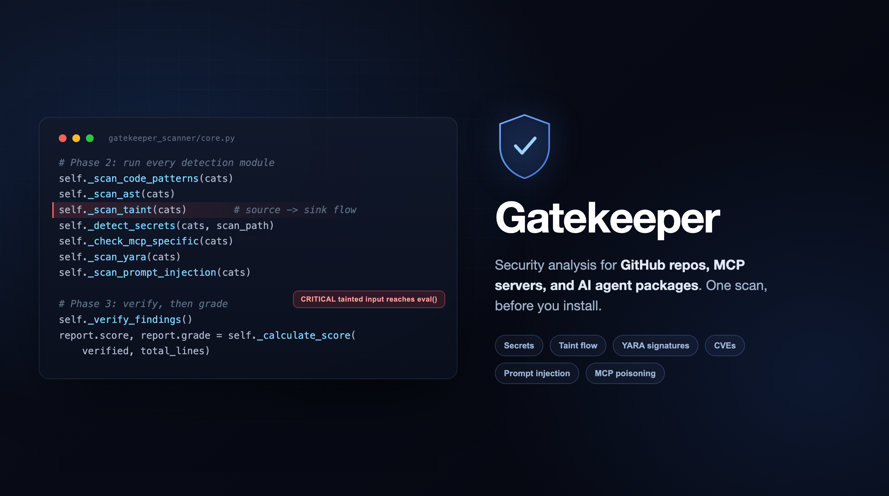

# Gatekeeper



**Is this repo, MCP server, or agent package safe to install? Run one scan and find out, before it touches your machine.**

Built by [Simcha Brodsky](https://github.com/skyblueso) ([@simchabrodsky](https://x.com/simchabrodsky))

  

---

## The short version

You are about to install something you did not write. A GitHub repo, an MCP server for your AI agent, a package with a one-line setup command. Be honest: you are not going to read all of its code first. Almost nobody does. We clone, we install, we paste the command, and we hope.

Gatekeeper is the check you run in the two minutes before that. Point it at the thing, and it answers one question in plain English: **is this safe to install, or not?** You get a letter grade from A to F, the exact findings behind it, and enough context to make the call yourself.

```bash
uvx --from gatekeeper-scanner gatekeeper https://github.com/user/repo
```

That is the whole idea. No account, no config, no setup. A grade in under a minute.

## The longer version (for the security folks)

Semgrep, CodeQL, and Snyk are excellent tools, but they answer "where are the bugs in code I own?" Gatekeeper answers a different question: "is this stranger's code safe to let into my system?" It is built for the AI-tooling attack surface those scanners were never designed to see: a poisoned `CLAUDE.md` that quietly redirects your assistant, a tool description with a hidden prompt injection, an MCP schema rigged to shadow a trusted tool, a dependency that exists for no reason except to run a malicious install hook.

Under the hood, every scan runs:

- Single-line and multi-line **pattern detection** across 16 languages, plus Dockerfiles, Kubernetes manifests, GitHub Actions, and AI config files.
- **AST analysis** for Python: real parsing, not just regex, with import-alias resolution so `import os as o; o.system(x)` is still caught.
- **Intra-function taint tracking** that follows untrusted input (request data, argv, env, decorated handler params) to a dangerous sink, with sanitizer awareness.
- **YARA signatures** for known-bad payloads: webshells, reverse shells, cryptominers, droppers (optional engine).
- **Dependency checks**: known CVEs via pip-audit or npm, an OSV.dev fallback when those are absent, plus typosquats, phantom dependencies, and lockfile drift.
- The **AI and supply-chain surface** nobody else covers: MCP schema poisoning, prompt injection in tool descriptions, base-URL hijacking, install-hook abuse, and evasion tricks built specifically to beat regex scanners (string assembly, chr() chains, aliased imports, invisible Unicode).

Then a **verification pass** downgrades the noise (test fixtures, vendored code, documentation, examples) so the grade reflects real risk, not raw pattern counts. On its own source Gatekeeper surfaces 52 findings and dismisses 452 as false positives, and grades itself A.

---

## Install

```bash
# Run on demand with uv, nothing installed
uvx --from gatekeeper-scanner gatekeeper <target>

# Or install it as a command
pipx install gatekeeper-scanner       # isolated, recommended
pip install gatekeeper-scanner        # plain pip
pip install gatekeeper-scanner[all]   # plus the optional YARA and pip-audit engines
```

Requires Python 3.9 or newer, and `git` for scanning remote repos. Nothing else. The optional engines (YARA signatures, pip-audit CVEs) are just that, optional; every other check runs without them.

Prefer to run from source with no install at all:

```bash
git clone https://github.com/skyblueso/gatekeeper
python3 gatekeeper/gatekeeper.py <target>
```

Everywhere below, `gatekeeper <target>` and `python3 gatekeeper.py <target>` are interchangeable.

---

## Scan something

```bash
gatekeeper https://github.com/user/repo         # a GitHub repo, before you install it
gatekeeper https://gitlab.com/user/repo         # GitLab works too
gatekeeper https://github.com/user/repo#branch  # a specific branch
gatekeeper https://github.com/org/mcp-server    # an MCP server package
gatekeeper /path/to/project                     # a local folder
gatekeeper /path/to/file.py                     # a single file
gatekeeper --self-scan                          # scan Gatekeeper's own source
```

---

## Example output

```
$ gatekeeper --self-scan

  Scanning: /path/to/gatekeeper...

  Discovered 52 potential vulnerabilities. Investigating...

  ============================================================
    SECURITY SCAN REPORT
  ============================================================
  Target:  /path/to/gatekeeper
  Type:    local_dir
  Scan:    1.0s
  ------------------------------------------------------------

  STRUCTURE
  Languages:    Python (100%)
  Files:        12 source, 3 config, 29 total
  Lines:        9,686

  DISCOVERY (52 potential vulnerabilities: 2 MEDIUM, 50 LOW)
  452 detections dismissed as false positives.

   !   [FILESYSTEM] shutil.rmtree(): recursive directory deletion
       gatekeeper_scanner/core.py:370

   .   [EXECUTION] eval(): executes arbitrary code (was HIGH)
       test_gatekeeper.py:91

   .   [EXECUTION] subprocess with shell=True: command injection risk (was CRITICAL)
       test_gatekeeper.py:99

    ... and more (mostly test-file detections, downgraded by context)

  RAW SCAN
  ████████████████████  A  SAFE

  [A] Clean. Safe to install.
```

Gatekeeper grades its own source A. It is a security scanner, so it is full of the exact patterns it hunts for: eval, exec, pickle, prompt-injection strings. The verification pass recognizes them as pattern definitions and test fixtures and downgrades them, which is the whole point. A scanner that cannot tell its own rules from a real payload is a scanner that cries wolf.

---

## All the options

```bash
# Output formats
gatekeeper <target> --json                 # machine-readable JSON
gatekeeper <target> --sarif                 # SARIF v2.1.0 (GitHub Advanced Security, GitLab, VS Code)
gatekeeper <target> --output report.json    # write the report to a path
gatekeeper <target> --quiet                 # grade and exit code only (good for CI)
gatekeeper <target> --verbose               # file-by-file progress and timing
gatekeeper <target> --no-color              # plain text (auto-off when piped)

# Scope
gatekeeper <target> --exclude "vendor/**,*.min.js,test/**"   # skip paths by glob
gatekeeper <target> --diff main                              # only files changed since a ref
gatekeeper <target> --max-files 100000                       # raise the file cap for huge repos
gatekeeper <target> --timeout 120                            # scan timeout in seconds

# Engines (all on by default)
gatekeeper <target> --skip-deps    # no dependency audit (offline or air-gapped)
gatekeeper <target> --no-osv       # no OSV.dev network CVE fallback
gatekeeper <target> --no-yara      # no YARA signature scanning
gatekeeper <target> --no-taint     # no Python taint analysis

# Gates and baselines
gatekeeper <target> --policy "critical=0,high<=3"        # pass/fail thresholds for CI
gatekeeper <target> --save-baseline baseline.json         # record current findings
gatekeeper <target> --baseline baseline.json              # only report new findings
gatekeeper <target> --disable-rules "GK-EXE-eval,GK-NET-raw-socket"

# Trust and private repos
gatekeeper <target> --trust                # trust the target (enables its suppression config)
gatekeeper <target> --token ghp_xxx        # scan a private repo (token scoped to the subprocess)

# Info
gatekeeper --self-scan
gatekeeper --version
```

---

## What it scans

Every scan runs every check. No tiers, no "deep mode" to remember, no rules to write first.

| Category | What it catches |
|----------|-----------------|
| **SECRET** | API keys, tokens, passwords, private keys, database URLs, JWTs: AWS, GitHub, Anthropic, OpenAI, Stripe, Slack, GCP, Azure, Twilio, SendGrid, Telegram, and more. Plus secrets committed and later deleted (git history, on local clones). |
| **EXECUTION** | Shell execution, eval, dynamic code loading, unsafe deserialization, install hooks, across Python, JS/TS, Go, Rust, Java, Ruby, Shell, PHP, C/C++, C#. |
| **NETWORK** | Outbound calls, WebSockets, suspicious endpoints, exfiltration patterns, tunneling services, TLS validation bypass. |
| **FILESYSTEM** | Sensitive path access, directory traversal, recursive deletion, symlink attacks, insecure temp files, permission changes. |
| **INJECTION** | Prompt injection in tool descriptions, `CLAUDE.md` and `.cursorrules` poisoning, SQL, NoSQL, XSS, SSRF, XXE, SSTI, prototype pollution, log injection, GitHub Actions command injection, C/C++ buffer patterns. |
| **DEPENDENCY** | Known CVEs (pip-audit / npm, OSV.dev fallback), typosquats, phantom dependencies (declared, never imported), lockfile drift, suspicious install scripts. |
| **PERMISSION** | Root containers, privilege escalation, Docker socket mounts, SYS_ADMIN capabilities, setuid. |
| **OBFUSCATION** | Base64 and encoded payloads, string-concat evasion (`'ev' + 'al'`), chr() chains, variable assembly, aliased imports, invisible Unicode, high-entropy blobs, minified code, precompiled binaries. |
| **MCP** | Tool shadowing, schema poisoning (parameters, defaults, required fields, not just descriptions), rug-pull indicators, config injection, base-URL hijacking. |
| **CI/CD** | GitHub Actions untrusted-input injection, `pull_request_target` privilege escalation, stale action references. |
| **DOCKER** | Root user, secrets in build args or ENV, curl-pipe-shell, privileged containers, socket mounts, host networking. |
| **KUBERNETES** | Privileged pods, hostPath mounts, excessive RBAC, missing security contexts. |
| **SIGNATURE** | YARA matches for known-bad content: PHP webshells, reverse shells, cryptominers, PowerShell download-and-run, Python droppers, base64-embedded executables. Optional (`yara-python`). |
| **TAINT** | Python intra-function data flow: untrusted input reaching a dangerous sink, with two trust levels and sanitizer awareness. |
| **LICENSE** | Missing LICENSE, restrictive licenses that may affect your distribution rights. |

**Languages:** Python, JavaScript, TypeScript, Go, Rust, Java, Kotlin, Ruby, PHP, Swift, C, C++, C#, Lua, Perl, Shell, plus Dockerfile, Kubernetes YAML, GitHub Actions, and AI config files (`CLAUDE.md`, `.cursorrules`, Copilot and Cursor configs). Python, JS/TS, Go, Rust, Java, Ruby, PHP, and Shell have deep coverage; Swift, C/C++, Perl, Lua, and C# catch the common dangerous patterns but are not full audits.

Every finding carries a stable rule ID (like `GK-EXE-eval`) and a CWE identifier in the JSON and SARIF output.

---

## How it works

Four phases, every scan:

1. **Walk.** One pass over the file tree categorizes every file (source, config, AI config, binary, Dockerfile, Kubernetes, CI pipeline) and builds an index. It skips the usual noise (`node_modules`, `.git`, `__pycache__`, `vendor`, `dist`).
2. **Detect.** All detection modules run against the index in parallel: single-line and multi-line patterns, entropy-scored secret detection, AST analysis, taint tracking, MCP schema inspection, dependency audit, obfuscation and aliased-import tracing, and git-history scanning on local clones.
3. **Verify.** Every raw finding goes through a contextual pass before scoring. Findings in test files, vendored code, docs, and examples are downgraded by context. This is how Gatekeeper stays quiet without you tuning rules, and it dismisses roughly fifteen times more findings than it keeps.
4. **Score.** Verified findings are weighted by severity and mapped to a letter grade.

---

## Grading

| Grade | Verdict | Meaning |
|-------|---------|---------|
| **A** | INSTALL | Clean. No meaningful findings. |
| **B** | INSTALL | Low risk. Minor findings worth noting, nothing blocking. |
| **C** | REVIEW FIRST | Patterns worth checking against the tool's stated purpose. Likely fine, but look. |
| **D** | DO NOT INSTALL: VULNERABLE | Real holes: hardcoded credentials, unsafe deserialization, exposed admin surfaces. Probably careless, still dangerous. |
| **F** | DO NOT INSTALL | Critical or malicious: data exfiltration, prompt injection targeting your AI assistant, obfuscated backdoors, supply-chain attacks. |

The line between D and F matters. A D was probably written by someone careless. An F may be trying to harm you.

**CI exit codes:** `0` for A/B/C, `1` for D/F. Change the gate with `--policy`.

---

## The trust model

This is the part that makes Gatekeeper safe to point at hostile code.

A repo you are evaluating gets **zero say** over its own grade. Project config (`.gatekeeper.json`, `.gatekeeper-ignore`, inline `# gatekeeper: ignore` comments) is only read from a **trusted** target: a local folder, or a remote repo you explicitly scan with `--trust`. It is never read from an untrusted remote repo, so a malicious project cannot ship a config that silences its own findings.

And even on a trusted target, suppression has a hard floor: it can quiet LOW and MEDIUM noise, but it can **never** hide a `CRITICAL`, `HIGH`, or `SECRET` finding, through any lever (config `suppress`, inline ignore, or `severity_weights`). When a target's config tries, the finding still surfaces and the attempt is reported. Files a target excludes from the scan are disclosed too, so nothing gets quietly dropped before it is looked at. A repo should never be able to talk Gatekeeper out of showing you something serious.

### Configuration

Drop a `.gatekeeper.json` in your own project root to tune Gatekeeper for it:

```json
{
  "exclude": ["vendor/**", "tests/**", "*.min.js"],
  "severity_weights": { "CRITICAL": 15, "HIGH": 7, "MEDIUM": 3, "LOW": 1, "INFO": 0 },
  "suppress": [
    {
      "rule": "GK-EXE-eval",
      "files": ["src/template-engine.py"],
      "reason": "Sandboxed template evaluation, intentional"
    }
  ],
  "custom_patterns": [
    {
      "pattern": "internal_secret_var\\s*=",
      "category": "SECRET",
      "severity": "HIGH",
      "message": "Internal secret variable detected",
      "languages": [".py", ".js"]
    }
  ]
}
```

- **`exclude`**: globs to skip during the walk.
- **`severity_weights`**: override default scoring (cannot lower CRITICAL/HIGH below their floor on a target you did not author).
- **`suppress`**: silence specific findings by rule ID and path. A `reason` is required.
- **`custom_patterns`**: add your own detection rules on top of the built-ins.
- **`.gatekeeper-ignore`**: one glob per line (`#` for comments), merged with `--exclude`. Trusted targets only.

### Inline suppression

```python
secret_key = load_from_vault()  # gatekeeper: ignore
```
```javascript
exec(command, options)  // gatekeeper: ignore
```

Trust-gated, and still bound by the CRITICAL/HIGH/SECRET floor above.

---

## CI/CD

```yaml
# .github/workflows/security.yml
name: Gatekeeper Security Scan
on: [push, pull_request]

jobs:
  scan:
    runs-on: ubuntu-latest
    steps:
      - uses: actions/checkout@v4
      - uses: actions/setup-python@v5
        with:
          python-version: "3.11"

      - name: Install Gatekeeper
        run: pip install gatekeeper-scanner

      - name: Scan
        run: gatekeeper . --sarif --output results.sarif
        continue-on-error: true

      - name: Upload to GitHub Advanced Security
        uses: github/codeql-action/upload-sarif@v3
        with:
          sarif_file: results.sarif
```

**Baselines**, to only report new findings:

```bash
gatekeeper . --save-baseline .gatekeeper-baseline.json   # first run
gatekeeper . --baseline .gatekeeper-baseline.json        # later runs
```

**Policy gates**, to fail on thresholds instead of a letter grade:

```bash
gatekeeper . --policy "critical=0,high<=3"
```

---

## Python API

```python
from gatekeeper_scanner import SecurityScanner, generate_sarif
import json

scanner = SecurityScanner(
    skip_deps=False,
    exclude_patterns=["vendor/**", "tests/**"],
    config={"severity_weights": {"CRITICAL": 20, "HIGH": 8, "MEDIUM": 2, "LOW": 1, "INFO": 0}},
)

# Accepts a GitHub or GitLab URL, a local path, or a single file
report = scanner.scan("https://github.com/user/repo")

print(report.grade)     # "A".."F", or "ERROR"
print(report.score)     # 0 to 100
print(report.verdict)   # "INSTALL", "REVIEW BEFORE INSTALLING", "DO NOT INSTALL", ...

for f in report.findings:
    print(f.category, f.severity, f.file, f.line, f.rule_id, f.cwe, f.message)

# SARIF for CI dashboards
print(json.dumps(generate_sarif(report), indent=2))
```

---

## How it compares

**vs. Semgrep / CodeQL.** Both do full inter-procedural taint tracking and deep data flow, and they are more powerful on complex control flow. They also need language-specific rules, language servers, and setup to get value. Gatekeeper needs nothing: run it against any repo in any language and get a grade in under a minute. Its taint pass is intra-function only, a lighter pass aimed at pre-install triage, not exhaustive review. For triaging unknown code, Gatekeeper wins on speed and breadth. For auditing your own codebase, reach for Semgrep or CodeQL.

**vs. Snyk.** Snyk is mainly a dependency CVE scanner with great IDE integration. It does not read code patterns, AI config files, MCP schemas, or supply-chain install-hook tricks. The overlap is dependency scanning, where Gatekeeper uses pip-audit and npm under the hood to cover the same ground.

**What only Gatekeeper covers:** the MCP and AI attack surface. Prompt injection in tool descriptions and parameter schemas. `CLAUDE.md` poisoning aimed at Claude Code users. Config attacks on Cursor and Copilot. Phantom dependencies that exist purely to run a malicious install hook. Evasion built specifically to beat regex detection. No commercial scanner covers this, because the surface barely existed until recently. That is what Gatekeeper was built for.

---

## Known limitations

Be honest with yourself about what this is and is not.

- **Taint is intra-function only.** It follows untrusted input to a sink within one Python function. It does not track a tainted value across functions, files, or imports. Semgrep and CodeQL do; Gatekeeper does not. Good enough for pre-install triage, not a substitute for full data-flow review.
- **Remote scans are shallow clones.** Fast, but git-history secret scanning (finding secrets that were committed then deleted) only runs on full local clones. Clone it yourself and scan the path if you need history.
- **Phantom-dependency false positives.** Runtime plugin loaders that resolve package names dynamically can look like phantom deps. Suppress those.
- **Foundational coverage for Swift, C/C++, Perl, Lua, C#.** Common dangerous patterns are caught; these are not comprehensive audits yet.
- **`--token` visibility.** A private-repo PAT is scoped to the git subprocess, not exported globally, but it lives in the cloned repo's git config until the temp directory is cleaned up at scan end.

---

## Roadmap

Early stage and improving regularly. When a detection gap is found, it gets patched. Planned next:

- More language depth (Perl, and new targets like R, Zig, and Move for Sui/Aptos smart contracts), and deeper C/C++.
- Better machine-readable output for SIEM and dashboards.
- More AI-specific patterns as MCP poisoning and agent prompt-injection techniques get documented.
- Full git-history scanning for remote repos, not just local clones.

If you want to help build something genuinely new in the AI and agentic security space, detection patterns, new languages, architecture, I would love the help. Reach out on X: [@simchabrodsky](https://x.com/simchabrodsky).

---

## Contributing

See [CONTRIBUTING.md](CONTRIBUTING.md). For bugs, ideas, and everything else: [@simchabrodsky](https://x.com/simchabrodsky).

## License

MIT
